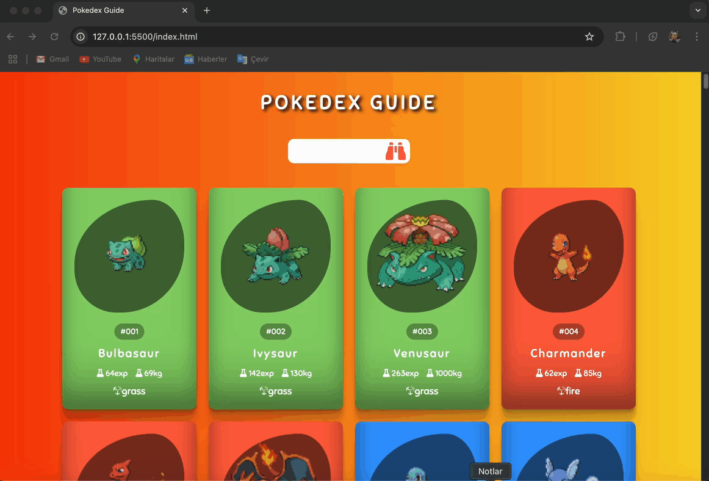

<h1>🚀 Pokedex app</h1>

Bu proje, Pokemon hakkında detaylı bilgiye hızlı ve eğlenceli bir şekilde erişim sağlamak için tasarlanmıştır. API entegrasyonu sayesinde gerçek zamanlı verilerle çalışır ve dinamik bir kullanıcı deneyimi sunmayı hedefler. Bu proje, hem teknik becerilerimi geliştirmek hem de kullanıcı dostu bir arayüz tasarlamak için harika bir fırsat sundu.

<h2>🛠️ Kullanılan Teknolojiler</h2>

-Html
-Css
-JavaScript

<h2>⚙️ Özellikler</h2>

<h6>Tasarım:</h6

Dinamik Yapı: Tasarımda kullanılan modern CSS teknikleri ve esnek bileşenler, farklı cihazlar için uyumluluk sağlamak amacıyla geliştirilecek şekilde yapılandırılmıştır.

<h6>Kullanıcı Deneyimi:</h6

Etkili Gezinim: Pokemon bilgilerine hızlı erişim sağlayan dinamik kartlar ve etkileşimli öğeler ile kullanıcı deneyimi kolaylaştırılmıştır.
Etkileşimli Öğeler: API'den çekilen verilerle dinamik kartlar ve detaylı bilgiler sunularak kullanıcı etkileşimi artırılmıştır.

<h1>🎬 Ekran Görüntüsü</h1>

